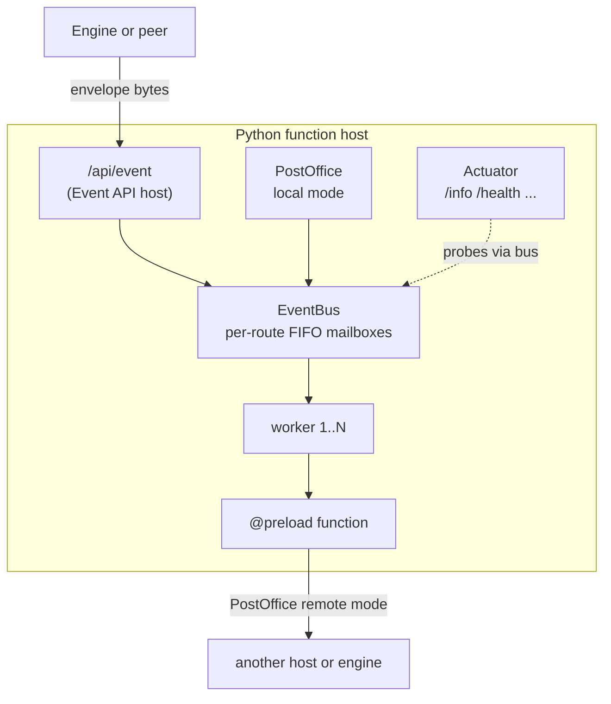

# Design — The Wrapper Anatomy

*Foundations: what is inside, and why each piece earns its place.*

> **At a glance**
>
> - **What** — the five components of the function host and the design rulings behind
>   them: faithful `instances`/`private`, an anycast event bus, fail-fast deadlines,
>   and engine-identical operations.
> - **For** developers and reviewers who want the mental model before the API.

## Anatomy

Five components, one dispatch pipeline:

| Component | Engine convention it mirrors |
|-----------|------------------------------|
| **Envelope codec** (`EventEnvelope`) | the [standard wire format](https://accenture.github.io/mercury-composable/guides/event-envelope-wire-format/), verified against golden vectors shared with both engines |
| **Event API host** (`POST /api/event`) | the engines' `event.api.service` semantics: `x-ttl` bounds execution, `x-async` is drop-n-forget, handler errors ride HTTP 200 inside the envelope |
| **Primitive event bus** | the engines' in-memory bus semantics: per-route FIFO, `instances` worker tasks, deliver (RPC) and publish (drop-n-forget) — nothing else |
| **PostOffice** | the engines' `po.request`/`po.send` vocabulary — remote to any peer's `/api/event`, local through the same bus |
| **Actuator + index page** | the engines' operational surface: `/`, `/info`, `/info/routes`, `/env`, `/health`, `/livenessprobe`, pretty JSON, the same error signature |

## The rulings, and why

**`instances` and `private` are faithful, not decorative.** Each route has one FIFO
mailbox consumed by exactly `instances` worker tasks — the parameter really is the
concurrency limit, as in the engines. `private=True` means what it means there too:
callable in-app through PostOffice, while the wire answers 403. A developer who reads
the engine documentation forms expectations this host meets.

**The bus is an anycast work queue, deliberately hand-built.** Each delivery goes to
exactly one of N workers and waits its FIFO turn while all are busy. That contract is a
work queue, not a broadcast — which is why the implementation is a small mailbox on
asyncio primitives rather than a pub/sub construct. Two operations only:

- `deliver` — RPC bounded by the caller's ttl; a queued call whose caller already
  timed out is skipped, never wastefully executed (the dead-work check).
- `publish` — drop-n-forget, acknowledged with the engines' 202 shape.

**No spill tier, no queue cap, fail fast by deadline.** Back-pressure belongs to the
tier that owns recovery — the engines' flows and graphs ([Rationale](rationale.md)).
A breach produces the standard `408` envelope (`Timeout for N ms`), identical to an
engine timeout, so flows handle both the same way.

**Blocking code cannot hurt the host.** Plain `def` handlers run in a thread-pool
executor with trace context carried across; the event loop that serves every other
route is never blocked. This is the Python analog of the Java engine's virtual
threads: *write sequential blocking-style code; the platform makes it safe.*

**Sync functions compose through a bridge, not a second API.**
`PostOffice.request_sync()`/`send_sync()` submit the same coroutines onto the host
loop while blocking only the handler's own worker thread — trace chain unbroken,
identical envelope shaping. Misuse teaches: calling the bridge on the event loop, or
outside a hosted function, raises a descriptive error instead of deadlocking.

**In-memory only.** In-flight events die with the process, exactly like the engines'
own in-memory bus; at-least-once behavior comes from flow-level retries, not from a
leaf journal.

## The scope fence

The package intentionally contains **no flows, no graphs, no persistence and no
pub/sub broadcast**. What it carries is deliberately minimal: functions, the primitive
bus, the thin client, and the engine-consistent utilities (configuration, logging,
trace). Divergence from an engine convention is treated as a bug, not a style choice.

## Where to go next

[Function Writing Patterns](function-patterns.md) turns this anatomy into day-to-day
code.
